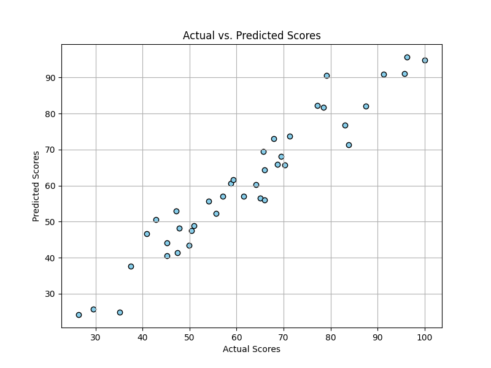
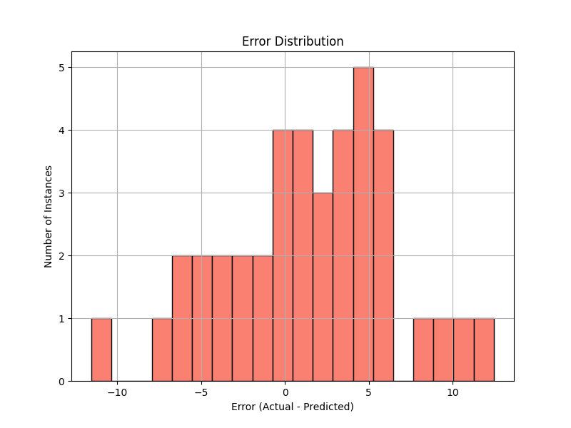

# Exam Outcome Predictor

This project is a user-friendly web application designed to predict how well a student might perform on an exam based on personal study habits, mental health indicators, and subjective experiences. Built using Python and Flask, it shows a practical use-case of machine learning models in everyday tools.

## What Does It Do?

The application helps students estimate their potential exam scores using various lifestyle and study-related factors. Students enter personal data, and the app calculates and visually presents a predicted score.

## Input Parameters

| Parameter                    | Type          | Description                                     |
|------------------------------|---------------|-------------------------------------------------|
| Hours of Sleep               | Integer       | Hours of sleep before the exam                  |
| Anxiety Level                | Integer (1-10)| Self-reported anxiety level                     |
| Burnout Feeling              | Boolean       | Presence of mental/physical exhaustion          |
| Attendance Rate              | Percentage    | Class attendance percentage                     |
| Homework Completion Rate     | Percentage    | Percentage of completed homework assignments    |
| Hours Studied                | Integer       | Total hours spent studying                      |
| Perceived Course Complexity  | Integer (1-10)| Subjective rating of course difficulty          |

### Type of Model
This project utilizes **Multiple Linear Regression** by establishing a linear relationship between the dependent variable (exam scores) and independent variables (sleep, anxiety, attendance, etc.).

### Model Training and Performance

The model was trained on synthetically generated data. Data was split into training (80%) and testing (20%) subsets.

#### Evaluation metrics values

- **Mean Absolute Error (MAE)**: 4.18 (predictions typically deviate by approximately 4 points).
- **R² score**: 0.82 (about 82% of variability in exam scores is explained by the model).

